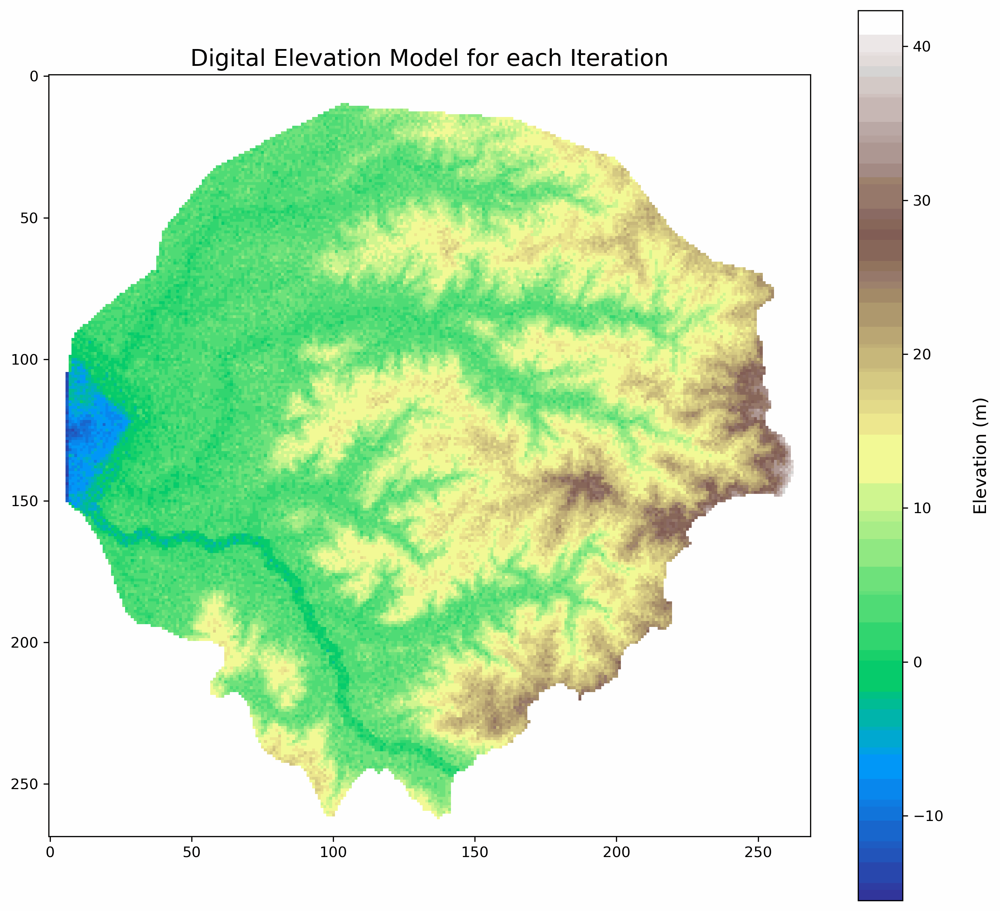
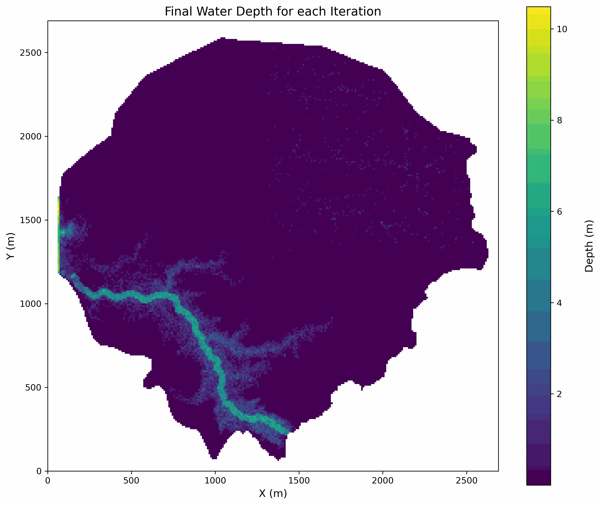
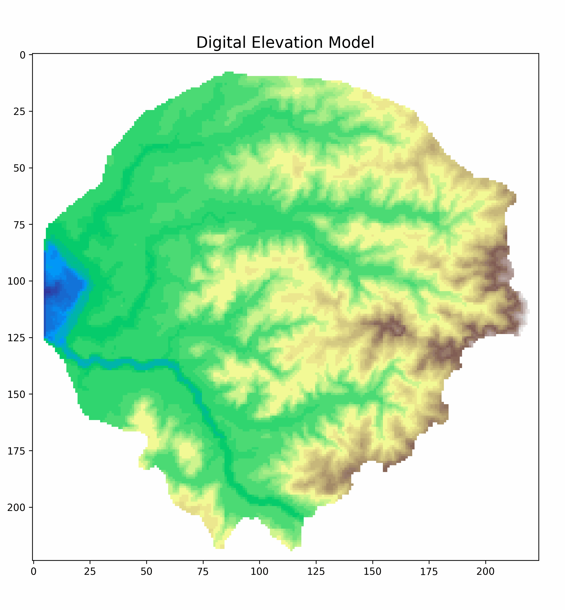
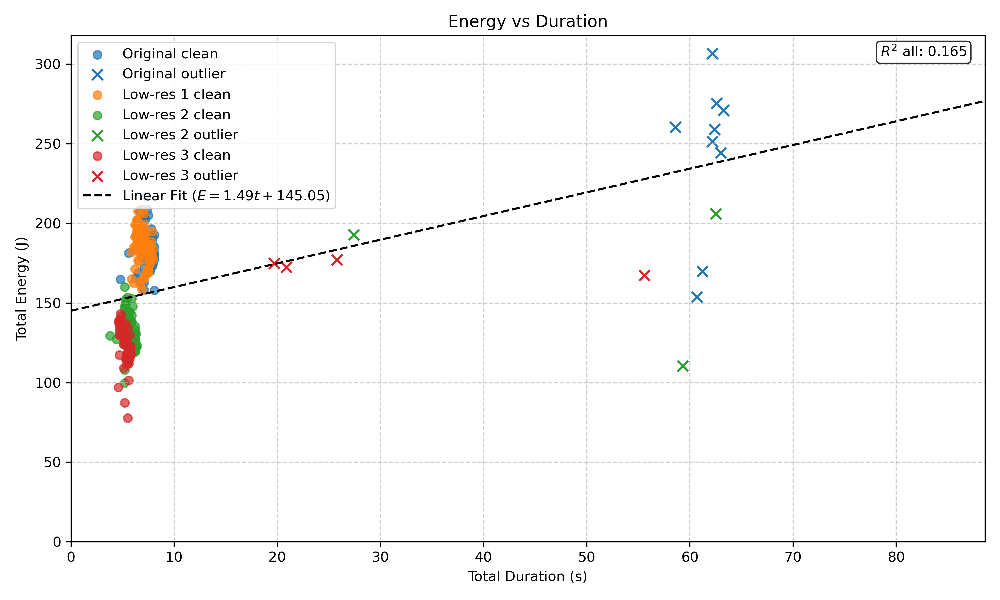
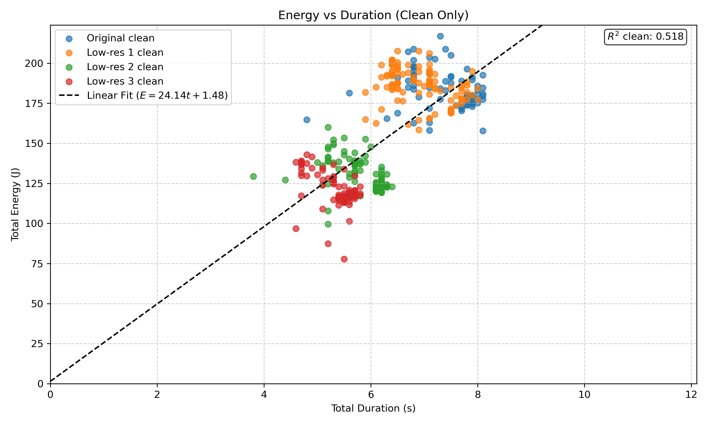
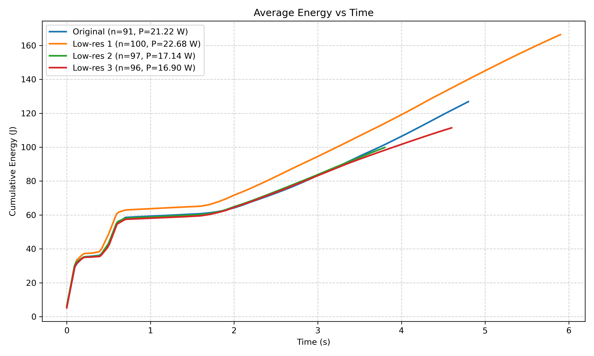
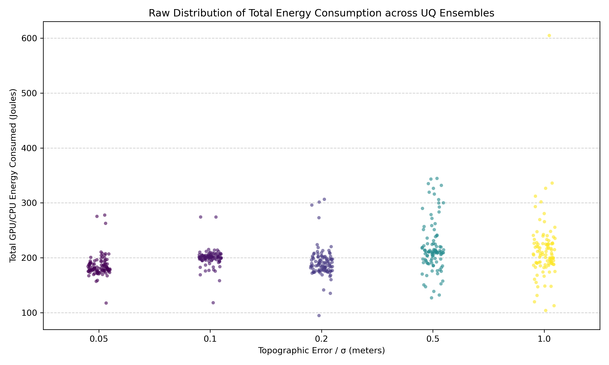
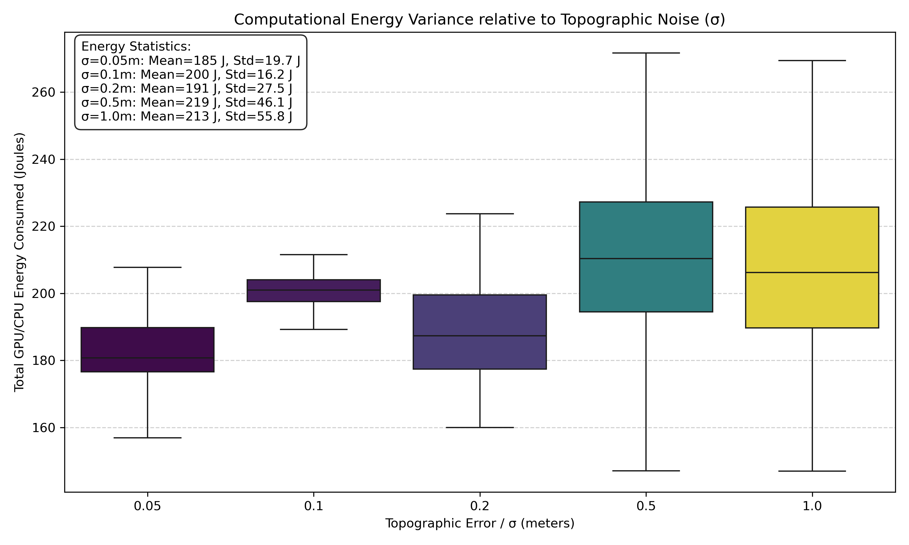

## Table of Contents

* [Introduction](#intro)
* [Motivation](#motivation)
* [Methodology](#methodology)
* [Results](#results)
* [References](#references)

## Introduction {#intro}

  
  
<strong>Figure 1:</strong> Original vs. Noisy DEM

## The Impact of DEM Uncertainty

::: {.callout-important appearance="simple" style="margin-bottom: 20px;"}
"Overlooking DEM uncertainty may lead to a bias in risk management decisions" [@Zhao2020]
:::

::: {style="display: flex; align-items: flex-start; justify-content: space-between; width: 100%; margin-top: 20px;"}

::: {style="width: 50%;"}
::: {.fragment data-fragment-index="1"}
### The Physical Link
<ul style="list-style-type: disc; padding-left: 30px; margin-bottom: 20px;">
  <li style="font-size: 20px; margin-bottom: 10px;">Topography governs downhill flow physics.</li>
  <li style="font-size: 20px; margin-bottom: 10px;">Surface variations alter mathematical predictions [@Zhao2020].</li>
</ul>
:::

::: {.fragment data-fragment-index="2"}
### The Solution
<ul style="list-style-type: disc; padding-left: 30px;">
  <li style="font-size: 20px; margin-bottom: 10px;">Use an “ensemble of equiprobable realizations” [@Zhao2020].</li>
</ul>
:::
:::

::: {style="width: 50%; text-align: center; margin-top: -40px;"}
{style="max-height: 470px; width: auto; object-fit: contain;"}

<strong>Figure 2:</strong> DEM for each Iteration

:::

:::

## The Impact of DEM Uncertainty

::: {style="display: flex; align-items: center; justify-content: space-between; gap: 20px; width: 100%; margin-top: -30px;"}

::: {style="width: 48%; font-family: 'Poppins', sans-serif;"}

<table style="width: 100%; border-collapse: collapse; font-size: 20px; text-align: center; box-shadow: 0 4px 10px rgba(0,0,0,0.1);">
  <thead>
    <tr style="background-color: #0052a3; color: white;">
      <th style="padding: 15px; border: 1px solid #dee2e6;">$\sigma_{input}$</th>
      <th style="padding: 15px; border: 1px solid #dee2e6;">Mean (m)</th>
      <th style="padding: 15px; border: 1px solid #dee2e6;">Std. Dev (m)</th>
      <th style="padding: 15px; border: 1px solid #dee2e6;">CV (%)</th>
    </tr>
  </thead>
  <tbody style="color: #333;">
    <tr>
      <td style="padding: 12px; border: 1px solid #dee2e6; font-weight: bold; background-color: #f8fafc;">0.05</td>
      <td style="padding: 12px; border: 1px solid #dee2e6;">0.739</td>
      <td style="padding: 12px; border: 1px solid #dee2e6;">$\pm 0.050$</td>
      <td style="padding: 12px; border: 1px solid #dee2e6;">6.78%</td>
    </tr>
    <tr style="background-color: #f1f5f9;">
      <td style="padding: 12px; border: 1px solid #dee2e6; font-weight: bold; background-color: #f8fafc;">0.1</td>
      <td style="padding: 12px; border: 1px solid #dee2e6;">0.756</td>
      <td style="padding: 12px; border: 1px solid #dee2e6;">$\pm 0.110$</td>
      <td style="padding: 12px; border: 1px solid #dee2e6;">14.50%</td>
    </tr>
    <tr>
      <td style="padding: 12px; border: 1px solid #dee2e6; font-weight: bold; background-color: #f8fafc;">0.2</td>
      <td style="padding: 12px; border: 1px solid #dee2e6;">0.774</td>
      <td style="padding: 12px; border: 1px solid #dee2e6;">$\pm 0.206$</td>
      <td style="padding: 12px; border: 1px solid #dee2e6;">26.61%</td>
    </tr>
    <tr style="background-color: #f1f5f9;">
      <td style="padding: 12px; border: 1px solid #dee2e6; font-weight: bold; background-color: #f8fafc;">0.5</td>
      <td style="padding: 12px; border: 1px solid #dee2e6;">0.880</td>
      <td style="padding: 12px; border: 1px solid #dee2e6;">$\pm 0.446$</td>
      <td style="padding: 12px; border: 1px solid #dee2e6;">50.71%</td>
    </tr>
    <tr>
      <td style="padding: 12px; border: 1px solid #dee2e6; font-weight: bold; background-color: #f8fafc;">1.0</td>
      <td style="padding: 12px; border: 1px solid #dee2e6;">1.101</td>
      <td style="padding: 12px; border: 1px solid #dee2e6;">$\pm 0.817$</td>
      <td style="padding: 12px; border: 1px solid #dee2e6;">74.21%</td>
    </tr>
  </tbody>
</table>

:::

::: {style="width: 50%; text-align: center;"}
{style="max-height: 500px; width: auto; object-fit: contain;"}

**Figure 3:** Water depth uncertainty propagation.

:::

:::

## Motivation {#motivation}

::: {.fragment data-fragment-index="1"}
### The Computational Burden
<ul style="list-style-type: disc; padding-left: 40px; margin-left: 0; margin-bottom: 25px;">
  <li style="margin-bottom: 12px;">Generating an ensemble of 500 realizations requires massive computational throughput.</li>
  <li style="margin-bottom: 12px;">Running these simulations demands significant energy.</li>
</ul>
:::

::: {.fragment data-fragment-index="2"}
### The Attribution Challenge
<ul style="list-style-type: disc; padding-left: 40px; margin-left: 0;">
  <li style="margin-bottom: 12px;">Modern hardware often runs multiple tasks at the same time.</li>
  <li style="margin-bottom: 12px;">Hardware sensors report the *total* power of the card, not the energy used by a specific process.</li>
</ul>
:::

## Research Questions

<ul style="list-style-type: disc; padding-left: 40px; margin-left: 0;">
  <li class="fragment" data-fragment-index="0" style="margin-bottom: 25px; font-weight: bold; color: #000;">
    How can the energy consumption of heterogeneous scientific computing workloads be accurately measured and modeled under input and execution uncertainty?
  </li>
  
  <ul style="list-style-type: circle; padding-left: 60px; margin-top: 10px; font-size: 26px !important;">
    <li class="fragment fade-in-then-semi-out" data-fragment-index="1" style="margin-bottom: 15px;">
      What methodologies enable accurate process-level energy attribution in shared heterogeneous computing infrastructures?
    </li>
    <li class="fragment fade-in-then-semi-out" data-fragment-index="2" style="margin-bottom: 15px;">
      To what extent can execution time serve as a proxy for energy consumption in heterogeneous CPU–GPU computing systems?
    </li>
    <li class="fragment fade-in-then-semi-out" data-fragment-index="3" style="margin-bottom: 15px;">
      How does uncertainty in simulation inputs propagate to variability in computational energy consumption?
    </li>    
  </ul>
</ul>

## Methodology {#methodology}

<ul style="list-style-type: disc; padding-left: 40px; margin-bottom: 40px;">
  <li class="fragment" data-fragment-index="0">**Hardware:** Gaia HPC Cluster</li>
  <li class="fragment" data-fragment-index="1">**Solver:** Synxflow</li>
  <li class="fragment" data-fragment-index="2">**Soft Sensor:** Alumet 
    <ul style="list-style-type: circle; padding-left: 40px; font-size: 22px; margin-top: 5px; color: #4a4a4a;">
      <li>Isolates energy consumption by process-level GPU/CPU utilization percentages.</li>
    </ul>
  </li>
</ul>

::: {.fragment data-fragment-index="3" style="width: 100%; margin-top: 100px; position: relative;"}

  ITERATE
  

::: {style="display: flex; align-items: center; justify-content: space-between; width: 100%; gap: 12px;"}

::: {style="flex: 1; border: 1px solid #dee2e6; background: #fff; height: 90px; border-radius: 6px; box-shadow: 0 2px 4px rgba(0,0,0,0.05); display: flex; align-items: center; justify-content: center; font-size: 18px; color: #333;"}
Original DEM
:::

[→]{style="font-size: 26px; color: #0052a3; font-weight: bold;"}

::: {style="flex: 1; border: 1px solid #dee2e6; background: #fff; height: 90px; border-radius: 6px; box-shadow: 0 2px 4px rgba(0,0,0,0.05); display: flex; align-items: center; justify-content: center; font-size: 18px; color: #333;"}
Noise Injection
:::

[→]{style="font-size: 26px; color: #0052a3; font-weight: bold;"}

::: {style="flex: 1.1; border: 2px solid #0052a3; background: rgba(0, 82, 163, 0.03); height: 90px; border-radius: 6px; box-shadow: 0 4px 8px rgba(0, 82, 163, 0.1); display: flex; align-items: center; justify-content: center; font-size: 18px; color: #0052a3; font-weight: bold;"}
Alumet + Synxflow
:::

[→]{style="font-size: 26px; color: #0052a3; font-weight: bold;"}

::: {style="flex: 1; border: 1px solid #dee2e6; background: #fff; height: 90px; border-radius: 6px; box-shadow: 0 2px 4px rgba(0,0,0,0.05); display: flex; align-items: center; justify-content: center; font-size: 18px; color: #333;"}
Ensemble Analysis
:::

:::

<strong>Figure 4:</strong> Computational Pipeline Flowchart

:::

## Results {#results}

<ul style="list-style-type: disc; padding-left: 60px; margin-top: 0px;">
  <li style="margin-bottom: 40px; font-size: 32px; font-weight: bold; color: #0052a3;">
    The Failure of the Time Proxy
  </li>
  <li style="margin-bottom: 40px; font-size: 32px; opacity: 0.3;">
    Uncertainty Propagation of Energy Consumption
  </li>
</ul>

## Is Execution Time a Reliable Proxy? {auto-animate="true"}

::: {.fragment data-fragment-index="1"}
<ul style="list-style-type: disc; padding-left: 40px; margin-left: 0; margin-top: 0px;">
  <li style="margin-bottom: 25px; font-size: 28px;">Energy ($E$) is the product of power ($P$) and time ($t$).</li>
</ul>
:::

::: {.fragment data-fragment-index="2" style="text-align: center; margin-top: 80px;"}
::: {style="display: inline-block; padding: 30px 60px; border: 3px solid #0052a3; border-radius: 10px; background-color: #f8fafc; box-shadow: 0 4px 12px rgba(0,0,0,0.1);"}

$E = A + P \cdot t$

:::

:::

## Is Execution Time a Reliable Proxy? {auto-animate="true"}

::: {style="text-align: center; width: 100%; margin-top: -25px;"}
{width="40%"}

<strong>Figure 5:</strong> Comparison of Original and Downsampled DEM Resolutions

:::

## Is Execution Time a Reliable Proxy? {auto-animate="true"}

::: {style="text-align: center; width: 100%; margin-top: -20px;"}
{width="70%"}

<strong>Figure 6:</strong> Total energy consumption vs. execution duration for all iterations

:::

## Is Execution Time a Reliable Proxy? {auto-animate="true"}

::: {style="text-align: center; width: 100%; margin-top: -20px;"}
{width="70%"}

<strong>Figure 7:</strong> Total energy consumption vs. execution duration for all clean iterations

:::

## Is Execution Time a Reliable Proxy?

::: {style="text-align: center; width: 100%; margin-top: -20px;"}

{width="70%"}

<strong>Figure 8:</strong> Average Cumulative Energy-Time Plot

:::

## Results {#results-2}

<ul style="list-style-type: disc; padding-left: 60px; margin-top: 0px;">
  <li style="margin-bottom: 40px; font-size: 32px; opacity: 0.3;">
    The Failure of the Time Proxy
  </li>
  <li style="margin-bottom: 40px; font-size: 32px; font-weight: bold; color: #0052a3;">
    Uncertainty Propagation of Energy Consumption
  </li>
</ul>

## Uncertainty Quantification in consumed Energy

::: {style="text-align: center; width: 100%; margin-top: 20px;"}
{style="max-height: 520px; width: auto; object-fit: contain; display: block; margin: 0 auto;"}

<strong>Figure 9:</strong> Raw distribution of total energy consumption for each topographic noise level

:::

## Uncertainty Quantification in consumed Energy

::: {style="text-align: center; width: 100%; margin-top: 20px;"}
{style="max-height: 520px; width: auto; object-fit: contain; display: block; margin: 0 auto;"}

<strong>Figure 10:</strong> Statistical distribution of total energy consumption for each topographic noise level

:::

## Conclusion

<ul style="list-style-type: disc; padding-left: 40px; margin-left: 0; margin-top: 0px;">
  <li class="fragment" data-fragment-index="1" style="margin-bottom: 35px;">
    **Time is not a Proxy:** Execution duration fails to capture energy consumption due to dynamic hardware power signatures.
  </li>
  
  <li class="fragment" data-fragment-index="2" style="margin-bottom: 35px;">
    **The 0.2m Tipping Point:** Topographic noise beyond 20cm triggers non-linear explosions in both solver energy cost and water depth variance.
  </li>
  
  <li class="fragment" data-fragment-index="3" style="margin-bottom: 35px;">
    **Isolation is Essential:** Process-level attribution is mandatory for reliable Uncertainty Quantification in shared HPC environments.
  </li>
</ul>

## Outlook

<ul style="list-style-type: disc; padding-left: 40px; margin-left: 0; margin-top: 0px;">
  <li class="fragment" data-fragment-index="0" style="margin-bottom: 40px;">
    **The High-Resolution Energy Anomaly**
    <ul style="list-style-type: circle; padding-left: 40px; font-size: 26px; margin-top: 10px; color: #4a4a4a;">
      <li>Investigate why the 0.05m noise profile paradoxically exhibits higher energy variance (19.7 J) than the 0.1m profile (16.2 J).</li>
    </ul>
  </li>
  
  <li class="fragment" data-fragment-index="1" style="margin-bottom: 40px;">
    **Isolating the 60-Second Execution Stalls**
    <ul style="list-style-type: circle; padding-left: 40px; font-size: 26px; margin-top: 10px; color: #4a4a4a;">
      <li>Determine the exact root cause of the extreme 60-second hardware outliers present in the raw duration data.</li>
    </ul>
  </li>
</ul>

## References {#references}